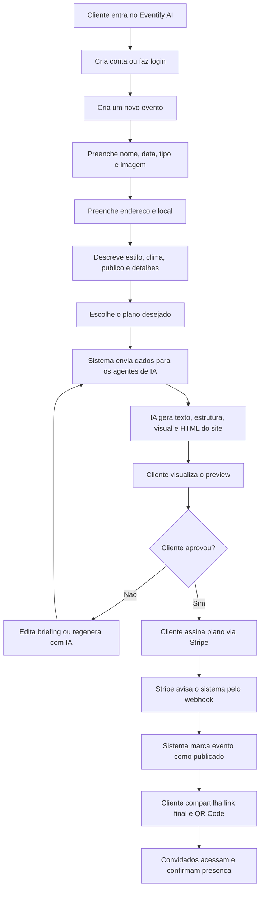
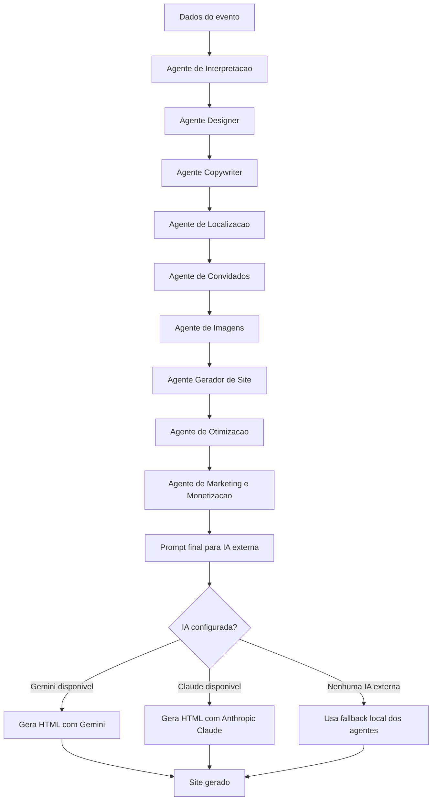
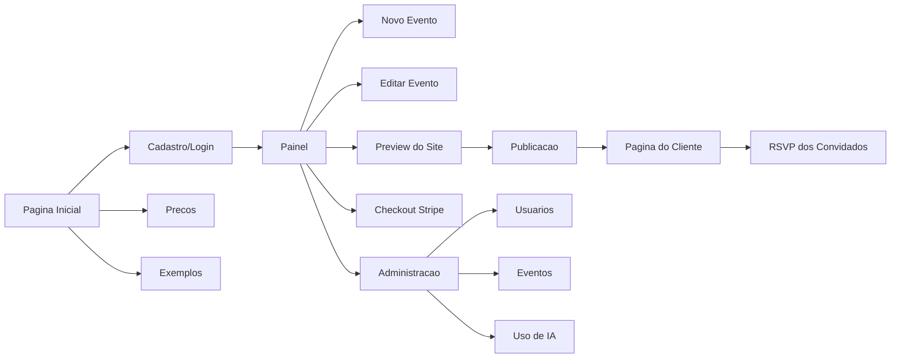
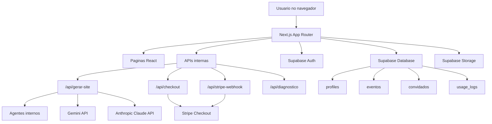
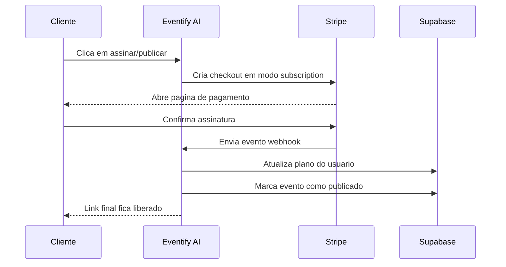

# Relatorio Completo do Projeto Eventify AI

Data do relatorio: 06/05/2026

Este documento explica o projeto Eventify AI de forma simples, organizada e completa. A ideia e que uma pessoa sem conhecimento tecnico consiga entender o que o sistema faz, para que serve, como funciona por dentro, o que ja esta pronto, o que depende de configuracao e o que ainda precisa evoluir.

---

## 1. Resumo Simples

O Eventify AI e uma plataforma online para criar sites profissionais de eventos usando inteligencia artificial.

Na pratica, o cliente informa os dados do evento, escolhe o plano, descreve o estilo desejado e o sistema gera automaticamente um site promocional com texto, visual, mapa, RSVP e link para compartilhar com convidados.

O objetivo comercial e vender esse sistema como um SaaS, ou seja, uma plataforma com assinatura mensal.

Exemplo de uso:

1. O cliente cria uma conta.
2. Ele informa nome, data, local e tipo do evento.
3. Ele escolhe o plano: Basico, Intermediario ou Premium.
4. A IA gera o site conforme o plano.
5. O cliente revisa o preview.
6. O cliente assina um plano recorrente via Stripe.
7. O site final fica publicado.
8. Os convidados acessam o link e confirmam presenca.

---

## 2. O Que o Produto Resolve

Criar um site de evento normalmente exige tempo, designer, copywriter, programador e revisoes. O Eventify AI reduz esse processo para poucos minutos.

O sistema resolve estes problemas:

- Falta de tempo para criar site de evento.
- Falta de conhecimento tecnico do cliente.
- Dificuldade de escrever textos bonitos e profissionais.
- Necessidade de ter mapa, data, informacoes e RSVP no mesmo lugar.
- Falta de uma pagina bonita para divulgar casamentos, aniversarios, festas, eventos corporativos e celebracoes.
- Necessidade de transformar isso em produto vendavel e escalavel.

---

## 3. Publico-Alvo

O sistema pode ser vendido para:

- Noivos e cerimonialistas.
- Aniversariantes e organizadores de festas.
- Empresas que fazem eventos corporativos.
- Produtores de shows, festas e festivais.
- Igrejas, comunidades e grupos religiosos.
- Buffets, saloes e casas de evento.
- Agencias e profissionais que querem revender sites de evento.

---

## 4. Fluxograma Geral do Produto



---

## 5. Como o Site Funciona Para o Cliente

O cliente nao precisa entender programacao. O fluxo e guiado.

### Passo 1: Criar Conta

O cliente acessa a pagina de cadastro, informa nome, email e senha.

Se o Supabase estiver configurado, a conta e criada com autenticacao real.

### Passo 2: Criar Evento

Na pagina de novo evento, o cliente informa:

- Nome do evento.
- Tipo do evento.
- Data.
- Imagem opcional.
- Plano desejado.
- CEP.
- Rua, numero, cidade e estado.
- Estilo visual.
- Clima do evento.
- Publico.
- Cor principal.
- Descricao livre.
- Detalhes especificos do tipo de evento.

### Passo 3: Escolher Plano

O cliente escolhe entre:

- Basico.
- Intermediario.
- Premium.

Essa escolha nao e apenas visual. Ela muda como a IA vai gerar o site.

### Passo 4: IA Gera o Site

O sistema envia os dados para os agentes internos e para a IA externa, quando configurada.

O resultado pode incluir:

- Titulo principal.
- Subtitulo.
- Texto promocional.
- Mensagem de convite.
- Destaques.
- Estrutura do site.
- HTML completo.
- Estilo visual.
- Secoes de mapa, RSVP, FAQ e informacoes.

### Passo 5: Preview

O cliente ve uma previa gratuita do site.

Se quiser, pode editar o briefing e gerar novamente.

### Passo 6: Assinatura e Publicacao

Quando o cliente quiser publicar, ele assina um plano mensal via Stripe.

Depois que o Stripe confirma, o site fica publicado e o link final fica liberado.

---

## 6. Diferenca Entre os Planos

O sistema ja entende o plano escolhido e usa isso para orientar a geracao.

### Plano Basico

Objetivo: site simples, direto e rapido.

Caracteristicas:

- Menos secoes.
- Texto mais curto.
- Visual limpo.
- Estrutura objetiva.
- Ideal para eventos pequenos ou clientes que querem publicar rapido.

O site tende a ter:

- Hero.
- Sobre o evento.
- Local.
- RSVP simples.
- Rodape.

### Plano Intermediario

Objetivo: site completo e equilibrado.

Caracteristicas:

- Mais secoes.
- Copy com mais contexto.
- Mapa.
- RSVP.
- Informacoes praticas.
- FAQ curto.
- Melhor organizacao para convidados.

O site tende a ter:

- Hero.
- Contagem regressiva.
- Sobre.
- Agenda quando houver dados.
- Local com mapa.
- Informacoes praticas.
- RSVP.
- FAQ.
- Rodape.

### Plano Premium

Objetivo: experiencia sofisticada e personalizada.

Caracteristicas:

- Visual mais editorial.
- Narrativa mais longa.
- Mais detalhes do briefing aparecem no site.
- Acabamento mais premium.
- Copy mais forte.
- Mais secoes.

O site tende a ter:

- Hero cinematografico ou editorial.
- Contagem regressiva refinada.
- Narrativa completa.
- Secao especifica por tipo de evento.
- Agenda.
- Pessoas importantes.
- Local com mapa e como chegar.
- Informacoes praticas em cards.
- RSVP.
- Presentes, ingressos ou inscricao quando houver.
- FAQ completo.
- Rodape premium.

---

## 7. Fluxograma da Geracao com IA



---

## 8. Agentes Implementados

O sistema ja possui uma estrutura de agentes. Eles funcionam como departamentos internos da empresa.

### Agente de Interpretacao

Entende o briefing do cliente e transforma pedidos vagos em direcao criativa.

Exemplo:

- Cliente escreve: "quero algo chique, mas simples".
- Agente interpreta: "visual elegante, limpo, com tipografia refinada e cores suaves".

### Agente Designer UI/UX

Define:

- Template.
- Paleta de cores.
- Tipografia.
- Direcao visual.
- Nivel visual conforme o plano.

### Agente Copywriter

Cria:

- Titulo.
- Subtitulo.
- Descricao.
- Mensagem de convite.
- CTA.
- SEO.
- Textos adaptados ao tipo de evento.

### Agente de Localizacao

Monta o endereco completo e prepara o link do mapa.

### Agente de Convidados

Analisa RSVP, convidados e duplicados.

### Agente de Imagens

Define se o site deve usar imagem enviada ou placeholder visual.

### Agente Gerador de Site

Define as secoes do site conforme evento e plano.

### Agente de Otimizacao

Calcula qualidade e aponta riscos, como briefing curto ou endereco incompleto.

### Agente de Marketing e Monetizacao

Cria sugestoes de upsell, ideias de venda e ganchos comerciais.

---

## 9. Estrutura do Site



---

## 10. Paginas Principais

### Pagina Inicial

Apresenta o produto, proposta de valor, exemplos e chamada para criar conta.

Arquivo principal:

- `app/page.tsx`

### Cadastro

Permite criar conta com email e senha.

Arquivo:

- `app/cadastro/page.tsx`

### Login

Permite acessar a conta.

Arquivo:

- `app/login/page.tsx`

### Painel

Area onde o usuario ve seus eventos, cria novos, edita, regenera com IA, publica e apaga.

Arquivo:

- `app/painel/page.tsx`

### Novo Evento

Formulario principal do produto. E onde o cliente informa os dados e escolhe o plano.

Arquivo:

- `app/novo-evento/page.tsx`

### Editar Evento

Permite atualizar dados do evento e regenerar o site.

Arquivo:

- `app/editar-evento/[slug]/page.tsx`

### Evento Pronto

Mostra status, qualidade, template, plano escolhido, preview e botoes para publicar.

Arquivo:

- `app/evento/[slug]/pronto/page.tsx`

### Pagina Promocional

Mostra o site gerado em formato promocional.

Arquivo:

- `app/promocional/[slug]/page.tsx`

### Pagina do Cliente

Pagina final para convidados acessarem apos publicacao.

Arquivo:

- `app/cliente/[slug]/page.tsx`

### Precos

Mostra os planos e inicia assinatura via Stripe.

Arquivo:

- `app/precos/page.tsx`

### Admin

Area administrativa com resumo do negocio, usuarios, eventos e uso de IA.

Arquivos:

- `app/admin/page.tsx`
- `app/admin/usuarios/page.tsx`
- `app/admin/eventos/page.tsx`
- `app/admin/uso/page.tsx`

### Pitch e Apresentacao

Paginas para explicar o produto comercialmente.

Arquivos:

- `app/pitch/page.tsx`
- `app/apresentacao/page.tsx`

---

## 11. Arquitetura Tecnica Simplificada



---

## 12. Banco de Dados

O Supabase guarda os dados principais.

### Tabela `profiles`

Guarda dados do usuario.

Campos importantes:

- `id`
- `full_name`
- `plan`
- `is_admin`
- `created_at`

Uso:

- Saber quem e o usuario.
- Saber plano ativo.
- Liberar admin.

### Tabela `eventos`

Guarda os eventos criados.

Campos importantes:

- `id`
- `owner_id`
- `slug`
- `nome`
- `tipo`
- `data`
- `status`
- `endereco`
- `imagem_url`
- `briefing`
- `selected_plan`
- `site_gerado`
- `site_html`
- `paid_at`
- `published_at`
- `paid_plan`

Uso:

- Salvar o evento.
- Guardar o site gerado.
- Controlar se esta em preview ou publicado.
- Guardar plano escolhido.

### Tabela `convidados`

Guarda confirmacoes de presenca.

Campos importantes:

- `id`
- `evento_id`
- `nome`
- `confirmado_em`

Uso:

- RSVP.
- Lista de convidados.
- Evitar nomes duplicados.

### Tabela `usage_logs`

Guarda uso de IA e custos.

Campos importantes:

- `user_id`
- `evento_id`
- `model`
- `provider`
- `input_tokens`
- `output_tokens`
- `cost_usd`
- `quality_score`
- `agent_run`
- `status`

Uso:

- Medir uso da IA.
- Acompanhar custo.
- Ver qualidade.
- Gerar dados para admin.

---

## 13. Fluxo de Publicacao e Pagamento



---

## 14. Integracoes Externas

### Supabase

Responsavel por:

- Login.
- Cadastro.
- Banco de dados.
- Storage de imagens.
- Regras de seguranca.

Status:

- Codigo implementado.
- Depende das variaveis de ambiente.
- Depende das migrations rodadas no banco.

### Stripe

Responsavel por:

- Checkout.
- Assinatura recorrente.
- Confirmacao de pagamento via webhook.
- Atualizacao do plano do usuario.

Status:

- Codigo implementado.
- Precisa usar `price_` recorrente, nao preco unico.
- Precisa configurar webhook em producao.

### Gemini

Responsavel por:

- Gerar HTML do site quando configurado.

Status:

- Codigo implementado.
- Depende de `GEMINI_API_KEY`.

### Anthropic Claude

Responsavel por:

- Gerar HTML e copy como fallback ou alternativa.

Status:

- Codigo implementado.
- Depende de `ANTHROPIC_API_KEY`.

---

## 15. Variaveis de Ambiente Necessarias

Estas variaveis precisam estar configuradas na Vercel para producao funcionar corretamente:

```env
NEXT_PUBLIC_APP_URL=
NEXT_PUBLIC_SUPABASE_URL=
NEXT_PUBLIC_SUPABASE_ANON_KEY=
SUPABASE_SERVICE_ROLE_KEY=
GEMINI_API_KEY=
ANTHROPIC_API_KEY=
ANTHROPIC_MODEL=
STRIPE_SECRET_KEY=
STRIPE_WEBHOOK_SECRET=
STRIPE_PRICE_BASICO=
STRIPE_PRICE_INTERMEDIARIO=
STRIPE_PRICE_PREMIUM=
DIAGNOSTICS_TOKEN=
```

Observacoes:

- `STRIPE_PRICE_*` deve ser preco recorrente mensal.
- `STRIPE_SECRET_KEY` deve pertencer a mesma conta dos prices.
- `STRIPE_WEBHOOK_SECRET` vem do webhook criado na Stripe.
- `DIAGNOSTICS_TOKEN` protege a rota de diagnostico.

---

## 16. Rota de Diagnostico

Existe uma rota para testar conexoes:

```text
/api/diagnostico
```

Ela verifica:

- Variaveis de ambiente.
- Supabase anon.
- Supabase service role.
- Stripe.
- Anthropic.
- Se o price Stripe e recorrente.

Ela exige token:

```text
/api/diagnostico?token=SEU_TOKEN
```

---

## 17. O Que Ja Esta Funcionando

Com base no estado atual do codigo:

- Projeto compila em producao.
- Lint roda sem erros.
- Pagina inicial existe.
- Cadastro existe.
- Login existe.
- Painel existe.
- Criacao de evento existe.
- Edicao de evento existe.
- Selecao de plano no evento existe.
- Estrategia de geracao por plano existe.
- Geracao com agentes internos existe.
- Integracao com Gemini existe.
- Integracao com Claude existe.
- Fallback local existe.
- Preview existe.
- Pagina promocional existe.
- Pagina final do cliente existe.
- RSVP existe.
- Lista de convidados existe.
- Mapa por endereco existe.
- Checkout Stripe recorrente existe.
- Webhook Stripe existe.
- Admin existe.
- Logs de uso de IA existem.
- Diagnostico existe.
- Exemplos comerciais existem.
- Pitch deck existe.
- Apresentacao comercial existe.

---

## 18. O Que Esta Funcionando Localmente

Validacao realizada:

```text
npm run build
```

Resultado:

```text
Passou
```

Validacao realizada:

```text
npm run lint
```

Resultado:

```text
Passou sem erros
```

Warnings restantes:

- Algumas imagens usam `` em vez de `next/image`.
- `BrandHeader` tem uma variavel `user` nao usada.

Esses warnings nao quebram o projeto, mas devem ser tratados antes de uma versao mais refinada.

---

## 19. O Que Depende de Configuracao Externa

Mesmo com o codigo funcionando, producao depende de configuracao correta.

### Supabase

Precisa confirmar:

- Projeto Supabase criado.
- URL e anon key configuradas.
- Service role configurada.
- Migrations rodadas.
- Bucket `event-images` criado.
- Politicas RLS corretas.
- Usuario admin marcado com `is_admin = true`.

### Stripe

Precisa confirmar:

- Produtos criados.
- Prices mensais recorrentes criados.
- Variaveis `STRIPE_PRICE_*` configuradas.
- Webhook apontando para `/api/stripe-webhook`.
- Eventos do webhook selecionados.

Eventos necessarios:

- `checkout.session.completed`
- `customer.subscription.updated`
- `customer.subscription.deleted`

### IA

Precisa confirmar:

- `GEMINI_API_KEY` configurada, se for usar Gemini.
- `ANTHROPIC_API_KEY` configurada, se for usar Claude.
- Modelo valido em `ANTHROPIC_MODEL`.

---

## 20. O Que Ainda Nao Esta Completo

O projeto ja e um MVP avancado, mas ainda nao esta em nivel de SaaS totalmente pronto para escala.

Pontos que faltam:

- Area do cliente para cancelar assinatura.
- Portal do cliente Stripe.
- Historico de pagamentos.
- Cupons e descontos.
- Pix/Mercado Pago.
- Dominio personalizado.
- Analytics completos por evento.
- Exportacao mais robusta de convidados.
- Testes automatizados.
- Conversao de `` para `next/image`.
- Melhor tratamento visual de erros.
- Melhor monitoramento de producao.
- Painel financeiro real.
- Controle de limites por plano mais visivel para o usuario.
- Templates premium ainda mais distintos.
- Geracao ou biblioteca real de imagens.

---

## 21. Riscos Atuais

### Risco 1: Ambiente de producao incompleto

Se Vercel nao tiver todas as variaveis, Supabase, Stripe e IA nao vao funcionar.

### Risco 2: Migrations nao rodadas

Se a coluna `selected_plan` nao existir no Supabase, o plano escolhido pode nao salvar corretamente.

Migration importante:

```text
supabase/migrations/0006_selected_plan.sql
```

### Risco 3: Stripe com preco errado

Se usar preco unico em vez de preco recorrente, o checkout de assinatura quebra.

### Risco 4: Webhook nao configurado

Se o webhook Stripe nao estiver configurado, o cliente pode pagar, mas o sistema nao publicar o evento automaticamente.

### Risco 5: IA sem chave

Se Gemini e Claude nao estiverem configurados, o sistema usa fallback local. Funciona, mas a qualidade pode ser menor.

---

## 22. O Que Um Cliente Ve

Para o cliente comum, o produto deve parecer assim:

1. "Eu entro no site."
2. "Crio minha conta."
3. "Preencho os dados do meu evento."
4. "Escolho o plano."
5. "A IA gera meu site."
6. "Eu reviso."
7. "Eu assino."
8. "Meu site fica publicado."
9. "Eu mando o link para convidados."
10. "Os convidados confirmam presenca."

O cliente nao precisa saber que por tras existem APIs, banco, agentes, webhooks e modelos de IA.

---

## 23. O Que o Administrador Ve

O administrador consegue acompanhar:

- Quantidade de usuarios.
- Eventos criados.
- Eventos publicados.
- Planos.
- Custos de IA.
- Uso por modelo.
- Logs.
- Usuarios.
- Eventos.

Isso ajuda a transformar o projeto em empresa, porque permite medir custo, receita e uso.

---

## 24. Modelo de Negocio Atual

O projeto esta estruturado para assinatura mensal.

Planos atuais:

- Basico: R$ 29/mes.
- Intermediario: R$ 49/mes.
- Premium: R$ 79/mes.

Logica comercial:

- O cliente pode testar/criar antes.
- Para publicar, assina.
- Quanto maior o plano, mais completo e sofisticado o site.

---

## 25. Por Que Isso Pode Ser Lucrativo

O produto tem potencial porque combina:

- Demanda recorrente por eventos.
- Criacao automatizada.
- Baixo custo operacional.
- Planos mensais.
- Possibilidade de upsell.
- Possibilidade de vender para parceiros.
- Possibilidade de criar templates premium.
- Possibilidade de cobrar por dominio, suporte, fotos, copy premium e gestao de convidados.

O caminho mais direto para faturar nao e adicionar muitas funcionalidades agora. O mais importante e validar venda real com clientes reais.

---

## 26. Prioridades Recomendadas

### Prioridade 1: Fechar Producao

- Conferir env vars na Vercel.
- Rodar migrations no Supabase.
- Testar cadastro real.
- Testar criacao real de evento.
- Testar geracao real com IA.
- Testar checkout real.
- Testar webhook real.
- Testar publicacao real.

### Prioridade 2: Vender Manualmente

- Criar 3 a 5 exemplos muito fortes.
- Vender para conhecidos, pequenos eventos, cerimonialistas e buffets.
- Cobrar preco real.
- Observar duvidas e objeções.

### Prioridade 3: Melhorar Produto

- Portal de assinatura.
- Analytics.
- Mais templates.
- Melhor admin financeiro.
- Melhor controle por plano.
- Melhor qualidade visual premium.

---

## 27. Checklist de Producao

Antes de vender de verdade:

- [ ] Vercel com todas as variaveis.
- [ ] Supabase com todas as migrations.
- [ ] Usuario admin configurado.
- [ ] Bucket de imagens configurado.
- [ ] Stripe com prices recorrentes.
- [ ] Stripe webhook configurado.
- [ ] Diagnostico em producao retornando OK.
- [ ] Cadastro testado.
- [ ] Login testado.
- [ ] Criacao de evento testada.
- [ ] Geracao de IA testada.
- [ ] Checkout testado.
- [ ] Publicacao testada.
- [ ] RSVP testado.
- [ ] Admin testado.

---

## 28. Estado Final do Projeto Hoje

O Eventify AI esta em estado de MVP avancado.

Ele ja tem:

- Produto navegavel.
- Fluxo de criacao.
- IA/agentes.
- Planos.
- Assinatura recorrente.
- Admin.
- Banco preparado.
- Diagnostico.
- Paginas comerciais.
- Exemplos.

O principal trabalho agora nao e inventar outro produto. E fechar producao, testar ponta a ponta e vender.

Resumo direto:

```text
Codigo: funcionando localmente
Produto: MVP avancado
Comercial: pronto para validacao com clientes reais
Producao: depende de env vars, Supabase, Stripe, IA e migrations
Proximo passo: testar fluxo real completo em producao
```

